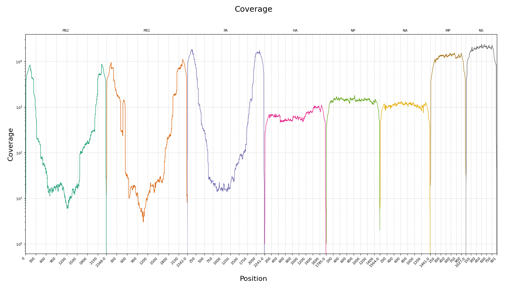
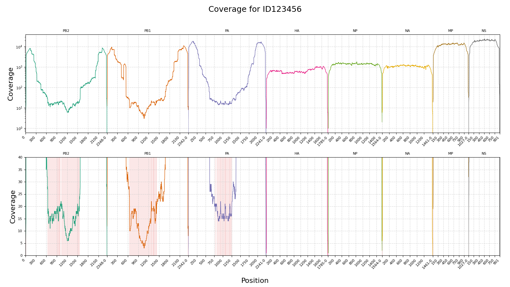

# Tacos

`tacos` is a Python CLI tool that plots genome coverage data from a tab-separated file.

## Installation

Clone and install locally:

```bash
git clone https://github.com/izsvenezie-virology/tacos.git
cd tacos
pip install .
```

## Input format

The input coverage file must be tab-separated (`.tsv`), with no header, and 3 columns:

1. chromosome name
2. position
3. coverage

Can be obtained with [bedtools genomecov](https://bedtools.readthedocs.io/en/latest/content/tools/genomecov.html).

```bash
bedtools genomecov -d -ibam BAM_FILE > COVERAGE_FILE
```

## Usage

```bash
tacos [OPTIONS] COVERAGE_FILE OUTPUT_FILE
```

### Arguments

- `COVERAGE_FILE`: input coverage TSV file.
- `OUTPUT_FILE`: output plot file path (`.pdf`).

### Options

- `-s`, `--sample-name TEXT`: sample name to display in the plot title.
- `-m`, `--min-coverage INTEGER`: coverage threshold used to highlight low-coverage regions. Default: `0`.

## Examples

Basic plot:

```bash
tacos coverage.tsv coverage.pdf
```



Highlight low-coverage regions below 20x with sample name:

```bash
tacos -m 20 -s ID123456 coverage.tsv coverage_min20.pdf
```


